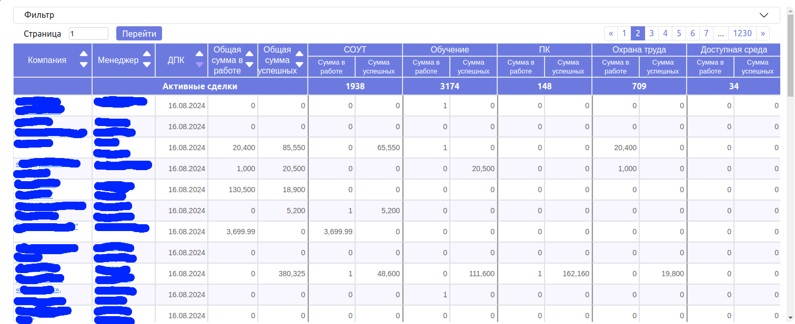

# CRM Отчеты и Статистика

Проект предназначен для улучшения бизнес-процессов с помощью отчетов по коммуникациям с клиентами, сделкам и статистике менеджеров. Приложение интегрируется с Битрикс для синхронизации данных и предоставляет гибкие фильтры и сортировку для управления информацией. 

## Основные возможности

### 1. Отчет по коммуникациям с клиентами и сделкам
Отчет предоставляет список компаний, суммы активных и успешных сделок по направлениям и дату последней коммуникации с клиентом. Если прошло несколько месяцев с последней коммуникации, дата подсвечивается красным, что сигнализирует о необходимости связаться с клиентом.

**Ключевые функции:**
- Отображение списка компаний с данными по активным и успешным сделкам.
- Подсветка просроченной даты последней коммуникации.
- Возможность фильтрации данных по ИНН, ответственному менеджеру, обороту компании, количеству сотрудников, направлению деятельности и другим параметрам.
- Сортировка по названию компании, ответственному, дате последней коммуникации, сумме активных и успешных сделок.

### 2. Отчет со статистикой по звонкам и встречам
Второй отчет позволяет просматривать статистику звонков и встреч по менеджерам и их отделам за выбранный период — год или месяц. Система также позволяет установить план звонков для каждого менеджера, следить за его выполнением и комментировать каждый день.

**Ключевые функции:**
- Просмотр количества звонков и встреч за день или месяц.
- Установка плана звонков для каждого менеджера.
- Индикация невыполненного плана до тех пор, пока он не будет завершен.
- Возможность руководителя принудительно отметить выполнение плана.
- Настройка ролей пользователей и прав доступа к данным.
- Исключение нерабочих дней из отчета с помощью календаря.
- Возможность обновления данных на сервере в случае рассинхронизации.

## Архитектура проекта

1. **dataapp** — Модуль для получения данных из Битрикс:
   - **Механизм оффлайн событий**: Используется встроенный механизм Битрикс для получения очереди событий. Приложение с определенной периодичностью запрашивает список совершенных событий и сохраняет их в базу данных.
   - **Обработка данных**: Полученные данные сохраняются в локальную базу данных для дальнейшего использования в отчетах.

2. **dpk_api_v1** — Модуль для отчета по коммуникациям с клиентами и сделкам:
   - **REST API**: Эндпоинты для получения, фильтрации и сортировки данных о компаниях, сделках и коммуникациях.
   - **Кеширование данных**: Кеширование результатов запросов по часто используемым фильтрам для оптимизации производительности.
   - **Frontend**: Используются JavaScript и HTML для динамического отображения данных и обновления интерфейса без перезагрузки страницы.

3. **cs_api_v1** — Модуль для отчета со статистикой по звонкам и встречам:
   - **REST API**: Эндпоинты для получения данных по звонкам и встречам с возможностью фильтрации по менеджерам, отделам и временным интервалам.
   - **Бизнес-логика**: Логика для установки и отслеживания выполнения планов по звонкам, включая подсчет статистики и подсветку невыполненных планов.
   - **Frontend**: JavaScript и HTML для визуализации данных статистики, установки планов и добавления комментариев.

4. **Аутентификация и авторизация**:
   - **JWT**: Аутентификация с использованием JWT токенов.
   - **Djoser**: Управление пользователями (регистрация, восстановление и смена пароля).
   - **Ролевая модель**: Разграничение доступа к функционалу приложения на основе ролей пользователей (менеджеры, руководители, администраторы).

5. **Синхронизация данных**:
   - **Обновление данных**: Возможность повторного запроса данных за определенный период времени при рассинхронизации.

## Технологии

- **Django REST Framework** для построения API.
- **JWT** и **Djoser** для аутентификации пользователей.
- **Битрикс** для интеграции данных с использованием оффлайн событий.
- **PostgreSQL** для хранения данных.

## Скриншоты

### Отчет по коммуникациям с клиентами и сделкам
1. 
2. 
3. 

### Отчет со статистикой по звонкам и встречам

1. 
2. 
3. 
4. 
5. 
6. 
